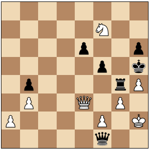

# FEN Parser

Forsyth-Edwards Notation (FEN) describes a chess position.
In a single line of ASCII text, it describes all the information 
about the state of a game.

# Examples

Here is an example FEN string: `8/5N2/4p2p/5p1k/1p4rP/1P2Q1P1/P4P1K/5q2 w - - 15 44`

And here is the position it describes:



Breaking down our example FEN string a bit:


```
                           castling ability
                                          | en passant target square
                                          | |    
                                          | |    fullmove counter
										  v v    v
8/5N2/4p2p/5p1k/1p4rP/1P2Q1P1/P4P1K/5q2 w - - 15 44
|                                     | ^      ^
 -------------------------------------  |      L halfmove clock
               |__ piece placement      |
                                      Side to move (white)
```
 
# Grammar

This is the BNF grammar that describes the FEN notation:

```
<FEN> ::=  <Piece Placement>
       ' ' <Side to move>
       ' ' <Castling ability>
       ' ' <En passant target square>
       ' ' <Halfmove clock>
       ' ' <Fullmove counter>


<Piece Placement> ::= <rank8>'/'<rank7>'/'<rank6>'/'<rank5>'/'<rank4>'/'<rank3>'/'<rank2>'/'<rank1>
<ranki>       ::= [<digit17>]<piece> {[<digit17>]<piece>} [<digit17>] | '8'
<piece>       ::= <white Piece> | <black Piece>
<digit17>     ::= '1' | '2' | '3' | '4' | '5' | '6' | '7'
<white Piece> ::= 'P' | 'N' | 'B' | 'R' | 'Q' | 'K'
<black Piece> ::= 'p' | 'n' | 'b' | 'r' | 'q' | 'k'

<Side to move> ::= {'w' | 'b'}

<Castling ability> ::= '-' | ['K'] ['Q'] ['k'] ['q'] (1..4)

<En passant target square> ::= '-' | <epsquare>
<epsquare>   ::= <fileLetter> <eprank>
<fileLetter> ::= 'a' | 'b' | 'c' | 'd' | 'e' | 'f' | 'g' | 'h'
<eprank>     ::= '3' | '6'

<Halfmove Clock> ::= <digit> {<digit>}
<digit> ::= '0' | '1' | '2' | '3' | '4' | '5' | '6' | '7' | '8' | '9'


```

For more information about what all these thinngs mean, check out the [Forsyth-Edwards Notation page on the Chess programming wiki](http://chessprogramming.wikispaces.com/Forsyth-Edwards+Notation)


# References

- http://chessprogramming.wikispaces.com/Forsyth-Edwards+Notation
- http://humanchimp.neocities.org/starting-position.html?8/5N2/4p2p/5p1k/1p4rP/1P2Q1P1/P4P1K/5q2%20w%20-%20-%2015%2044